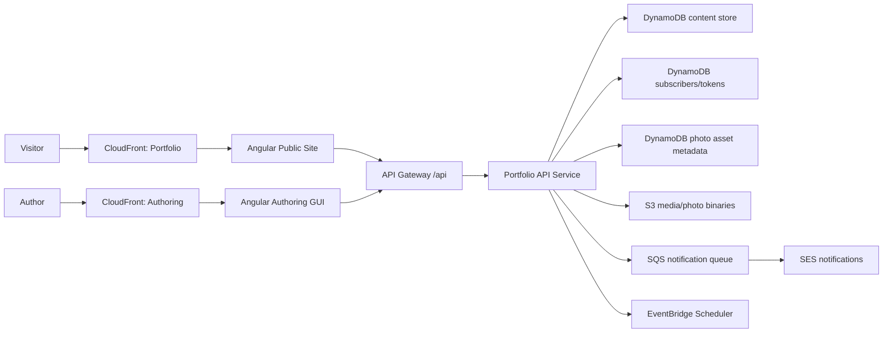
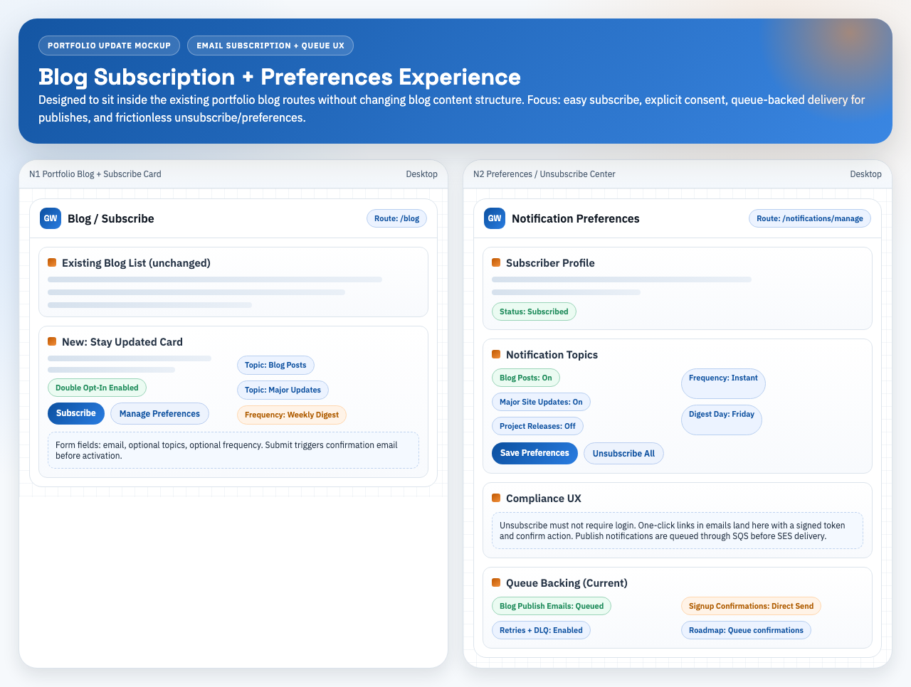
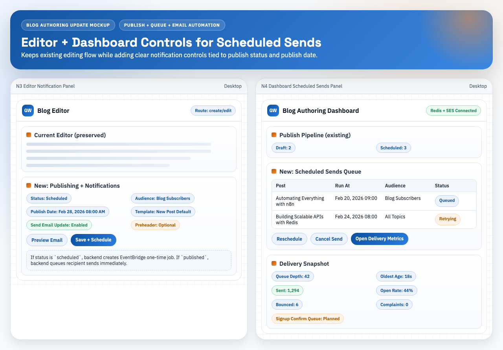

# Portfolio Platform (Public Site + Authoring + API)

Full-stack portfolio platform with:
- Public Angular site (`portfolio-app`)
- Authenticated Angular authoring console (`blog-authoring-gui`)
- Node.js/Express API (`redis-api-server`)
- AWS static hosting + API + notifications infrastructure
- No-cache, metadata-first route loading with AWS Lambda provisioned origin reads

## Production Endpoints

| Surface | URL |
|---|---|
| Public portfolio | `https://www.grayson-wills.com` |
| Apex redirect | `https://grayson-wills.com` -> `https://www.grayson-wills.com` |
| Blog authoring dev | `https://d39s45clv1oor3.cloudfront.net` |
| API base | `https://api.grayson-wills.com/api` |

## Repository Layout

- `portfolio-app/` — Public website frontend (Angular 19 + PrimeNG)
- `blog-authoring-gui/` — Authenticated authoring frontend (Angular 19 + Cognito)
- `redis-api-server/` — API layer (Express + DynamoDB-first + AWS integrations)
- `blog-author/` — Legacy local-only authoring app (Node/Express + vanilla UI)
- `design/` — UX/UI and architecture documentation + mockups
- `docs/comprehensive/` — end-to-end architecture/code documentation pack (Markdown + Word companions)
- `platform-blueprint/` — Reusable architecture/process blueprint for future website projects
- `scripts/` — smoke tests, review automation, sync utilities
- `.github/workflows/` — CI/CD + security + review pipelines

## Comprehensive Documentation Pack

The full architecture-to-code documentation set is in:
- `/Users/grayson/Desktop/Portfolio/docs/comprehensive/README.md`

Word companions (generated from the Markdown sources):
- `/Users/grayson/Desktop/Portfolio/docs/comprehensive/word/portfolio-platform-comprehensive-documentation.docx`
- `/Users/grayson/Desktop/Portfolio/docs/comprehensive/word/portfolio-platform-visual-mockups.docx`

## Architecture (Current)



## Implemented Capabilities

### Public Site (`portfolio-app`)

- Multi-page experience: Landing, Work, Projects, Blog, Notifications
- Blog list + full blog detail pages with rich body blocks
- Metadata-first loading with progressive image/body hydration and route-scoped in-memory request reuse
- SEO basics (`robots.txt`, `sitemap.xml`, meta tags)
- Email subscription UX:
  - Blog subscribe form
  - First-visit subscribe popup
  - Duplicate-aware messaging (`already subscribed`, `already pending`)
  - Confirm/unsubscribe pages under `/notifications/*`
- Cloud preview mode support using preview tokens (`previewToken` query param)
- Route-level metadata and SEO service updates

### Authoring GUI (`blog-authoring-gui`)

- Cognito-authenticated access (`/login`, `/forgot-password`, guarded routes)
- Dashboard + content studio for editing portfolio/blog content
- Metadata-first dashboard/content loading with route-scoped in-memory request reuse + batched hydration
- Keyboard shortcut system for global navigation + page-level actions
- Collections studio for non-blog writing assets (`/collections`):
  - category tab registry (create/archive/restore tabs)
  - collection entry CRUD (lyrics, poems, quotes, transcripts, interviews, notes, custom)
  - visibility control (`hidden` vs `public`) without exposing anything on the portfolio yet
  - text-file import (`.txt`, `.md`, `.rtf`, `.csv`, `.json`, `.html`) into entry body
- Blog editor with preview modes (title card + full post)
- Notification controls integrated into publish workflow
- Scheduled publish controls + immediate notify actions
- One-click unpublish action from the editor (published/scheduled -> draft + removed from public portfolio feed)
- Cloud preview generation against deployed public site using preview sessions
- Save-time inline image normalization: embedded `data:image/*` content is uploaded and rewritten to URL references before post save to avoid oversized payload failures

### Authoring Hotkey Standard (For New Pages)

When adding any new authoring page/route, include hotkeys by default:
- Add/confirm a route context in `HotkeyContext` (`/Users/grayson/Desktop/Portfolio/blog-authoring-gui/src/app/services/hotkeys.service.ts`).
- Map route to context in `resolveContextFromUrl` (`/Users/grayson/Desktop/Portfolio/blog-authoring-gui/src/app/app.component.ts`).
- Register page-specific bindings in the page component via `hotkeys.register('<context>', [...])`.
- Prefer the common pattern:
  - `Cmd/Ctrl + Alt + R` refresh
  - `Cmd/Ctrl + Alt + N` create new
  - one page-specific focus/action combo (`E`, `K`, `P`, etc.)
- Set `allowInInputs: true` only when the action is safe while typing.
- Verify visibility in the in-app hotkeys dialog (`Cmd/Ctrl + Alt + /`).

### API (`redis-api-server`)

- Route groups:
  - `/api/health`
  - `/api/content`
  - `/api/upload`
  - `/api/photo-assets`
  - `/api/admin`
  - `/api/subscriptions`
  - `/api/notifications`
- Security middleware stack:
  - `helmet`, CORS allowlist, rate limiting, body size limits
  - write endpoint protection via Cognito JWT middleware
- Content backends:
  - DynamoDB primary (`CONTENT_BACKEND=dynamodb|ddb`)
  - Redis compatibility mode (`CONTENT_BACKEND=redis`) for fallback/migration only
- Preview session API:
  - `POST /api/content/preview/session`
  - `GET /api/content/preview/:token`
- Streaming `v2` content APIs (additive, `v1` unchanged):
  - `GET /api/content/v2/page/:pageId`
  - `GET /api/content/v2/blog/cards`
  - `GET /api/content/v2/blog/cards/media`
  - `POST /api/content/v2/list-items/batch`
  - token-based pagination with filter-hash validation
  - frontend fallback to legacy `v1` reads if any `v2` call fails
  - feed telemetry events: `cards_rendered_initial`, `cards_images_hydrated`, `cards_next_page_loaded`
- Route-shaped `v3` read APIs for no-cache rendering:
  - `GET /api/content/v3/bootstrap`
  - `GET /api/content/v3/landing`
  - `GET /api/content/v3/work`
  - `GET /api/content/v3/projects/categories`
  - `POST /api/content/v3/projects/items`
  - `GET /api/content/v3/blog/:listItemId`
  - `GET /api/content/v3/admin/dashboard`
  - `GET /api/content/v3/admin/content`
- Dynamic API reads now return `Cache-Control: no-store`; old in-process GET response caching was removed
- Full API details:
  - `/Users/grayson/Desktop/Portfolio/docs/content-v2-streaming.md`
  - `/Users/grayson/Desktop/Portfolio/docs/no-cache-performance-rollout.md`
- Subscription lifecycle:
  - request/confirm/unsubscribe/preferences
  - duplicate prevention (`ALREADY_SUBSCRIBED`, `ALREADY_PENDING`)
- Notification pipeline:
  - send now (queue-backed when enabled)
  - schedule publish/send
  - unpublish API to immediately hide a post from public portfolio visibility
  - SQS consumer for async SES delivery
  - worker callback endpoint for scheduled jobs
  - stale schedule suppression by schedule-name matching to prevent delayed/duplicate sends

## Data Model

### Core Content Record

| Field | Type | Notes |
|---|---|---|
| `ID` | string | stable unique record id |
| `Text` | string? | text payload |
| `Photo` | string? | image/media URL |
| `ListItemID` | string? | groups related records |
| `PageID` | number | page bucket |
| `PageContentID` | number | semantic content role |
| `Metadata` | object? | status/tags/order/etc |
| `CreatedAt` | ISO date? | optional |
| `UpdatedAt` | ISO date? | optional |

Additional derived read-model attributes may also be present on persisted records:
- `PagePK`, `PageSK`
- `UpdatedPK`, `UpdatedSK`
- `FeedPK`, `FeedSK`

These support future GSI-backed read models and are already stamped on new writes.

## Performance Architecture (Current)

- Dynamic content is not API-cached and is not persisted in browser snapshot storage.
- Frontends reuse only in-flight and route-scoped in-memory requests during the active SPA session.
- Public route loading is additive:
  - header/footer from `v3/bootstrap`
  - landing hero/summary from `v3/landing`
  - work metrics + paged timeline from `v3/work`
  - project categories first, project card hydration second
  - blog detail metadata/body blocks from `v3/blog/:listItemId`
- Authoring route loading is additive:
  - dashboard from `v3/admin/dashboard`
  - Content Studio from `v3/admin/content`
  - no health-check call on normal route entry
- The API Lambda now runs on:
  - `arm64`
  - `1024 MB`
  - alias `live`
  - provisioned concurrency `2`

This keeps dynamic reads fast without relying on stale cache layers.

### `PageContentID` Values

| ID | Name |
|---|---|
| 0 | HeaderText |
| 1 | HeaderIcon |
| 2 | FooterIcon |
| 3 | BlogItem |
| 4 | BlogText |
| 5 | BlogImage |
| 6 | LandingPhoto |
| 7 | LandingText |
| 8 | WorkText |
| 9 | ProjectsCategoryPhoto |
| 10 | ProjectsCategoryText |
| 11 | ProjectsPhoto |
| 12 | ProjectsText |
| 13 | BlogBody |
| 14 | WorkSkillMetric |
| 15 | BlogSignatureSettings |
| 16 | CollectionsCategoryRegistry |
| 17 | CollectionsEntry |

### Collections Authoring Records (Authoring-Only)

Collections content is stored in the same `portfolio-content` table and API:
- `PageID=4`, `PageContentID=16`: single category-registry record (`Metadata.registry.categories[]`)
- `PageID=4`, `PageContentID=17`: one record per entry (body in `Text`, structured metadata in `Metadata`)

`CollectionsEntry` metadata includes:
- `title`, `summary`, `entryType`, `categoryId`
- `tags[]`
- `isPublic` + `visibility` (`public`/`hidden`)
- timestamps (`createdAt`, `updatedAt`, optional `publishedAt`)

This keeps the portfolio frontend unchanged while allowing authoring-side staging and visibility control.

### Blog Post Grouping

A blog post is represented by multiple records sharing one `ListItemID`:
- Blog metadata (`BlogItem`)
- Fallback/plain text (`BlogText`)
- Cover image (`BlogImage`)
- Rich body block JSON (`BlogBody`)

### Email Subscriber State

DynamoDB tables:
- `portfolio-email-subscribers` (status + topics + consent metadata)
- `portfolio-email-tokens` (hashed action tokens with TTL)

### Photo Asset State

Photo binaries + metadata:
- S3 bucket/prefix stores original files (`photo-assets/...`)
- DynamoDB table `portfolio-photo-assets` stores metadata + lifecycle state (`pending` -> `ready` -> `deleted`)
- Authoring flow:
  1. `POST /api/photo-assets/upload-url`
  2. Upload file directly to signed S3 URL
  3. `POST /api/photo-assets/:assetId/complete`

## Local Development

### Prerequisites

- Node.js **22 LTS** recommended
- npm 10+
- Angular CLI 19+
- DynamoDB (content + preview sessions tables)
- Optional Redis only for legacy compatibility mode

### Install

```bash
cd /Users/grayson/Desktop/Portfolio

cd redis-api-server && npm ci && cd ..
cd portfolio-app && npm ci && cd ..
cd blog-authoring-gui && npm ci && cd ..
# optional legacy tool
cd blog-author && npm ci && cd ..
```

### API Environment (`redis-api-server/.env`)

Minimum local setup:

```env
PORT=3000
NODE_ENV=development

ALLOWED_ORIGINS=http://localhost:4200,http://localhost:4300,http://localhost:4301,http://localhost:3000
CACHE_TTL_MS=60000
CACHE_MAX_ENTRIES=500
REQUEST_BODY_LIMIT=6mb

COGNITO_REGION=us-east-2
COGNITO_USER_POOL_ID=<pool-id>
COGNITO_CLIENT_ID=<client-id>
# local-only shortcut if needed
# DISABLE_AUTH=true

S3_UPLOAD_BUCKET=<optional-media-bucket>
S3_UPLOAD_REGION=us-east-2
S3_UPLOAD_PREFIX=uploads/
PHOTO_ASSETS_BUCKET=<optional-media-bucket>
PHOTO_ASSETS_REGION=us-east-2
PHOTO_ASSETS_PREFIX=photo-assets/
PHOTO_ASSETS_TABLE_NAME=portfolio-photo-assets
PHOTO_ASSETS_PRESIGN_EXPIRES_SECONDS=900
PHOTO_ASSETS_MAX_FILE_BYTES=15728640

PUBLIC_SITE_URL=http://localhost:4200
SES_FROM_EMAIL=<optional-sender>
SUBSCRIBERS_TABLE_NAME=portfolio-email-subscribers
TOKENS_TABLE_NAME=portfolio-email-tokens
SUBSCRIBE_ALLOWED_TOPICS=blog_posts,major_updates
NOTIFICATION_QUEUE_ENABLED=true
NOTIFICATION_QUEUE_URL=https://sqs.us-east-2.amazonaws.com/<account-id>/portfolio-email-notifications
SCHEDULER_GROUP_NAME=portfolio-email
SCHEDULER_INVOKE_ROLE_ARN=arn:aws:iam::<account-id>:role/PortfolioSchedulerInvokeLambdaRole
SCHEDULER_TARGET_LAMBDA_ARN=arn:aws:lambda:us-east-2:<account-id>:function:portfolio-redis-api

CONTENT_BACKEND=dynamodb
CONTENT_TABLE_NAME=portfolio-content
PREVIEW_SESSIONS_TABLE_NAME=portfolio-content-preview-sessions

# Optional Redis compatibility mode
# REDIS_HOST=<host>
# REDIS_PORT=<port>
# REDIS_PASSWORD=<password>
# REDIS_TLS=true
# REDIS_DB=0
```

### Frontend Feature Flags (`portfolio-app` + `blog-authoring-gui`)

```ts
useContentV2Stream: true
useBlogV2Cards: true
```

- `true`: use metadata-first `v2` reads + progressive hydration.
- `false`: fallback to existing `v1` content reads.

### Save Payload Guidance (Blog Authoring)

- Blog post content should store image URLs, not embedded base64 data URLs.
- The editor now automatically uploads inline `data:image/*` content and rewrites HTML before save.
- API request size cap is controlled by `REQUEST_BODY_LIMIT` (default `6mb`).
- If save returns `413`, verify image upload endpoints are healthy and the editor is connected to the current production API.

### Run Locally

```bash
# API
cd redis-api-server && npm start

# Public site
cd portfolio-app && npm start -- --port 4300

# Authoring GUI
cd blog-authoring-gui && npm start -- --port 4301

# Optional legacy author app
cd blog-author && npm start
```

## AWS Deployment + CI/CD

### Workflows

| Workflow | Purpose |
|---|---|
| `.github/workflows/ci-cd.yml` | Build/test/deploy portfolio + authoring static apps and run smoke tests |
| `.github/workflows/api-deploy.yml` | Deploy Lambda-based API (`portfolio-redis-api`) |
| `.github/workflows/ecs-deploy.yml` | Deploy ECS Fargate API variant |
| `.github/workflows/security.yml` | Gitleaks, CodeQL, npm audit |
| `.github/workflows/senior-review.yml` | Automated senior engineer review report + PR comment |

### Static Hosting Targets

- Portfolio bucket: `www.grayson-wills.com`
- Portfolio CloudFront: `E28CZKZOGGZGVK`
- Authoring bucket: `grayson-wills-blog-authoring-dev-381492289909`
- Authoring CloudFront: `E31OPQLJ4WFI66`

### Deploy Auth Model

Deployments use GitHub OIDC roles (no long-lived AWS access keys committed to repo).

### Required Post-Deploy Email Safety Check (Lambda + SES)

Run this after any change touching API deploy/config, subscriptions, notifications, or email templates.

1. Verify Lambda email env vars:
   - `SES_FROM_EMAIL`
   - `SES_REGION`
   - `PUBLIC_SITE_URL`
   - `EMAIL_BRAND_LOGO_URL`
2. Verify sender identity in SES for the same configured region.
3. Check CloudWatch logs for email failures in the deploy window:
   - `"[subscriptions] SES send failed"`
   - `"[subscriptions] Subscribed email failed"`
4. Validate one end-to-end subscription flow (request -> confirm -> subscribed).
5. Confirm subscriber row reaches `SUBSCRIBED` in `portfolio-email-subscribers`.

Example checks:

```bash
AWS_PROFILE=grayson-sso AWS_REGION=us-east-2 \
aws lambda get-function-configuration \
  --function-name portfolio-redis-api \
  --query 'Environment.Variables.{SES_FROM_EMAIL:SES_FROM_EMAIL,SES_REGION:SES_REGION,PUBLIC_SITE_URL:PUBLIC_SITE_URL,EMAIL_BRAND_LOGO_URL:EMAIL_BRAND_LOGO_URL}'

AWS_PROFILE=grayson-sso AWS_REGION=us-east-2 \
aws logs filter-log-events \
  --log-group-name /aws/lambda/portfolio-redis-api \
  --start-time $((($(date +%s)-3600)*1000)) \
  --filter-pattern '"[subscriptions] SES send failed"'
```

### Production Smoke Test

```bash
cd /Users/grayson/Desktop/Portfolio
bash scripts/smoke_prod.sh
```

Checks include:
- static site and SPA fallback
- SEO files
- apex redirect
- API health and auth boundaries
- CORS behavior
- direct S3 access protection

## Security Posture

- Public read, protected write endpoint model
- Cognito JWT validation for mutation routes
- API rate limiting (global + stricter write limiter)
- Body size limits and cache invalidation on writes
- Security scanning in CI (secret scan, SAST, dependency audit)
- Async notification queueing to absorb bursts and reduce direct API-to-SES coupling

## Design + Blueprint Documentation

- UX overhaul docs: `/Users/grayson/Desktop/Portfolio/design/ux-overhaul`
- Email notifications docs: `/Users/grayson/Desktop/Portfolio/design/email-notifications`
- Figma handoff spec (queue-aware): `/Users/grayson/Desktop/Portfolio/design/email-notifications/figma-handoff.md`
- Queue-aware subscription mockup: `/Users/grayson/Desktop/Portfolio/design/email-notifications/mockups/portfolio-subscription-update.html`
- Queue-aware authoring mockup: `/Users/grayson/Desktop/Portfolio/design/email-notifications/mockups/blog-authoring-notifications-update.html`
- MCP research docs: `/Users/grayson/Desktop/Portfolio/design/mcp-integration`
- Bedrock research: `/Users/grayson/Desktop/Portfolio/design/bedrock`
- Reusable architecture blueprint: `/Users/grayson/Desktop/Portfolio/platform-blueprint`

### Queue Mockup Previews




## Queue Rollout Notes

- Implemented: blog publish notifications enqueue to SQS, then Lambda consumes and sends via SES.
- AWS queue resources (us-east-2):
  - Main: `portfolio-email-notifications`
  - DLQ: `portfolio-email-notifications-dlq`
  - Lambda event source mapping: `4dc22ada-a904-45bb-a863-57851beb2203`
- Deferred: signup confirmation emails currently send directly from `/api/subscriptions/request`.
- Planned follow-up: move signup confirmations to the same queue path for unified retries/observability.

## Manual Production Deploy (Local Operator)

```bash
cd /Users/grayson/Desktop/Portfolio/portfolio-app
npm run build

AWS_PROFILE=grayson-sso AWS_REGION=us-east-2 \
aws s3 sync dist/portfolio-app/browser/ s3://www.grayson-wills.com/ \
  --exclude "index.html" \
  --cache-control "public,max-age=31536000,immutable"

AWS_PROFILE=grayson-sso AWS_REGION=us-east-2 \
aws s3 cp dist/portfolio-app/browser/index.html s3://www.grayson-wills.com/index.html \
  --cache-control "no-cache" --content-type "text/html"

AWS_PROFILE=grayson-sso AWS_REGION=us-east-2 \
aws cloudfront create-invalidation --distribution-id E28CZKZOGGZGVK \
  --paths "/index.html" "/" "/work" "/projects" "/blog" "/blog/*" "/notifications/*"
```

### One-Time CloudFront SPA Rewrite Hardening

Run this once to stop CloudFront from serving `index.html` for missing `.js/.css/.png` files:

```bash
cd /Users/grayson/Desktop/Portfolio
AWS_PROFILE=grayson-sso ./scripts/configure_cloudfront_spa_rewrite.sh \
  --distribution-id E28CZKZOGGZGVK \
  --distribution-id E31OPQLJ4WFI66
```

## Troubleshooting

### API not reachable from frontend
- Verify `redisApiUrl` in environment files
- Verify CORS `ALLOWED_ORIGINS`
- Check `https://api.grayson-wills.com/api/health`

### Authoring login issues
- Verify Cognito region/pool/client values in `blog-authoring-gui/src/environments/*`
- Confirm user exists and is confirmed in Cognito

### Subscriber sign-up failed
- Run the required Lambda+SES post-deploy checks above.
- Confirm `SES_FROM_EMAIL` is present on Lambda and verified in SES (`SES_REGION`).
- Inspect `/aws/lambda/portfolio-redis-api` for:
  - `"[subscriptions] SES send failed"`
  - `"[subscriptions] Subscribed email failed"`
- If a user is stuck `PENDING`/`ALREADY_PENDING`, re-trigger confirmation only after SES wiring is fixed.

### Build issues
- Reinstall clean:

```bash
rm -rf node_modules package-lock.json
npm install
```

### Quill import error in authoring GUI
- Ensure dependencies are installed in `blog-authoring-gui` (`npm ci` includes `quill`)

## Contact

- Email: `calvarygman@gmail.com`
- LinkedIn: `www.linkedin.com/in/grayson-wills`
- Website: `www.grayson-wills.com`

## License

Copyright © 2026 Grayson Wills. All rights reserved.
