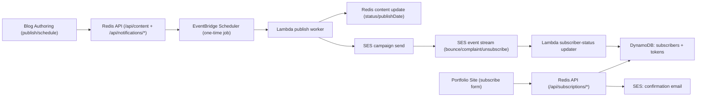

# AWS Email Notification Architecture (Portfolio + Blog Authoring)

## Goals

1. Notify subscribers when a blog post is published.
2. Support true scheduled publish + scheduled email notifications.
3. Keep unsubscribe and preferences first-class.
4. Avoid secrets in frontend code and use least-privilege IAM.

## Proposed AWS Services

1. **Amazon SES (v2)** for transactional/broadcast email delivery.
2. **Amazon EventBridge Scheduler** for one-time publish/send jobs.
3. **AWS Lambda** workers for publish processing and email dispatch.
4. **Amazon DynamoDB** for subscriber and token state.
5. **CloudWatch** for delivery/failure alarms and operational visibility.

## High-Level Flow

## Data Model (Recommended)

### Table: `portfolio-email-subscribers`

- `emailHash` (PK): SHA-256 of lowercase email.
- `email` (string): normalized email for SES delivery.
- `status`: `PENDING|SUBSCRIBED|UNSUBSCRIBED|BOUNCED|COMPLAINED`.
- `topics`: string set (example: `blog_posts`, `major_updates`).
- `source`: where signup happened (`blog-list`, `blog-detail`, `footer`).
- `createdAt`, `confirmedAt`, `unsubscribedAt`, `lastNotifiedAt`.
- `consentVersion`, `consentIp`, `consentUserAgent` (for auditability).

### Table: `portfolio-email-tokens`

- `tokenHash` (PK): hash of opaque token in email link.
- `emailHash`: links token to subscriber.
- `action`: `confirm` or `unsubscribe`.
- `expiresAtEpoch`: TTL attribute for automatic cleanup.

## API Changes (Redis API Server)

Add endpoints in `redis-api-server`:

1. `POST /api/subscriptions/request`
   - Validates email + preference topics.
   - Stores pending subscriber.
   - Sends double opt-in email via SES.
2. `GET /api/subscriptions/confirm?token=...`
   - Verifies token and marks subscriber `SUBSCRIBED`.
3. `POST /api/subscriptions/unsubscribe`
   - Accepts token and marks subscriber `UNSUBSCRIBED`.
4. `POST /api/subscriptions/preferences`
   - Updates topics/frequency for authenticated token holder.
5. `POST /api/notifications/send-now` (auth protected)
   - Sends campaign for a specific `listItemID`.
6. `POST /api/notifications/schedule` (auth protected)
   - Creates one-time Scheduler job for publish/send.
7. `DELETE /api/notifications/schedule/:jobId` (auth protected)
   - Cancels scheduled send.

## Publish + Schedule Behavior (App Logic)

### Publish Now

1. Author sets `status = published`.
2. Backend writes Redis metadata and triggers async notification send.
3. Worker builds email payload from blog metadata/body and sends to subscribed users.

### Scheduled Publish

1. Author sets `status = scheduled` and future `publishDate`.
2. Backend stores post as scheduled in Redis and creates EventBridge schedule.
3. At scheduled time, publish worker:
   - updates Redis post to `published`,
   - sends notification email (if enabled),
   - records send result.

## Portfolio App Changes

1. Add subscription form to blog page and blog detail page.
2. Add confirmation screen route (`/notifications/confirmed`).
3. Add unsubscribe/preferences route (`/notifications/manage`).
4. Remove direct Mailchimp API key usage from frontend (`portfolio-app/src/app/services/mailchimp.service.ts`) and replace with your own backend API calls.

## Blog Authoring GUI Changes

1. In editor sidebar, add a **Notifications** card:
   - `Send email update` toggle,
   - audience topic selector,
   - optional custom subject/preheader.
2. Keep existing `status` + `publishDate`, but pass them through to backend instead of forcing publish-now.
3. In dashboard, add a **Scheduled Sends** panel with next run time and cancel action.

## Cost-Aware Defaults

1. Use one-time schedules only, with cleanup after execution.
2. Send in batches sized to SES limits.
3. Store minimal fields in DynamoDB and TTL-expire short-lived tokens.
4. Start with single-region (`us-east-2`) resources to reduce complexity.

## Rollout Phases

1. **Phase 1:** backend foundation (DynamoDB + SES + subscription endpoints).
2. **Phase 2:** true schedule support (EventBridge Scheduler + publish worker).
3. **Phase 3:** frontend subscription/preferences UI (portfolio).
4. **Phase 4:** blog authoring notification controls + scheduled send panel.
5. **Phase 5:** production hardening (alarms, dashboards, runbooks, load tests).
