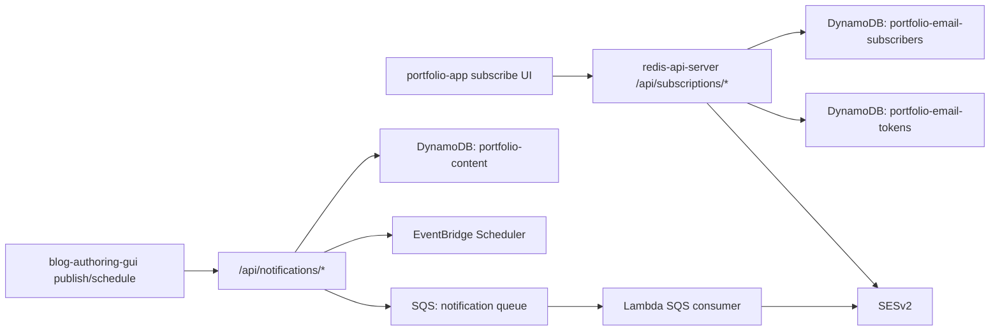

# AWS Email Notification Architecture (Current Implementation)

Last updated: 2026-03-04

## Goals

1. Double opt-in subscriber onboarding.
2. Reliable publish notifications (immediate + scheduled).
3. Single-send/idempotent behavior for post notifications.
4. Clear unsubscribe and preference management routes.

## Deployed Service Shape

```mermaid
flowchart LR
  Portfolio["portfolio-app subscribe UI"] --> API["redis-api-server /api/subscriptions/*"]
  API --> Subs["DynamoDB: portfolio-email-subscribers"]
  API --> Tokens["DynamoDB: portfolio-email-tokens"]
  API --> SES["SESv2"]

  Authoring["blog-authoring-gui publish/schedule"] --> Notify["/api/notifications/*"]
  Notify --> Content["DynamoDB: portfolio-content"]
  Notify --> Sched["EventBridge Scheduler"]
  Notify --> Queue["SQS: notification queue"]
  Queue --> Worker["Lambda SQS consumer"]
  Worker --> SES
```

## API Contract (Implemented)

### Public subscription endpoints

- `POST /api/subscriptions/request`
- `GET /api/subscriptions/confirm?token=...`
- `GET /api/subscriptions/unsubscribe?token=...`
- `POST /api/subscriptions/preferences`

Behavior:
- request:
  - validates + normalizes email
  - blocks duplicates (`ALREADY_SUBSCRIBED` / `ALREADY_PENDING`)
  - stores `PENDING`
  - sends confirmation email.
- confirm:
  - validates token
  - marks `SUBSCRIBED`
  - sends subscribed confirmation email.
- unsubscribe:
  - validates token
  - marks `UNSUBSCRIBED`
  - sends unsubscribe confirmation email.

### Authenticated notification endpoints

- `POST /api/notifications/send-now`
- `POST /api/notifications/schedule`
- `DELETE /api/notifications/schedule/:scheduleName`
- `POST /api/notifications/worker/publish` (internal scheduler callback, secret-protected)

Behavior:
- published + notify enabled -> queue-backed send path.
- scheduled -> EventBridge one-time schedule; worker publishes then optionally notifies.

## Data Model

### `portfolio-email-subscribers`

- PK: `emailHash`
- fields:
  - `email`
  - `status` (`PENDING|SUBSCRIBED|UNSUBSCRIBED|BOUNCED|COMPLAINED`)
  - `topics[]`
  - `source`
  - consent audit fields (`consentIp`, `consentUserAgent`, `consentVersion`)
  - lifecycle timestamps (`createdAt`, `confirmedAt`, `unsubscribedAt`, `updatedAt`)

### `portfolio-email-tokens`

- PK: `tokenHash`
- fields:
  - `emailHash`
  - `action` (`confirm|unsubscribe|manage`)
  - `expiresAtEpoch` (TTL)
  - `createdAt`

## Queue and Idempotency

Implemented:
- Post notifications enqueue to SQS.
- Lambda consumer sends via SES asynchronously.
- Notification service applies marker/lock logic to reduce duplicate sends during retries or rapid updates.

Planned follow-up:
- move signup confirmation emails to queue path for unified retry/visibility model.

## Frontend Integration (Current)

### Portfolio

- Blog page subscribe card posts to `/api/subscriptions/request`.
- Notification routes:
  - `/notifications/confirm`
  - `/notifications/unsubscribe`
  - `/notifications/manage`.

### Blog Authoring

- Dashboard/editor can trigger send-now or schedule actions.
- Subscriber admin tab reads and edits subscribers through `/api/notifications/subscribers`.

## Security Notes

- no provider API secrets in frontend runtime for this flow.
- write/admin endpoints require Cognito JWT auth.
- internal worker route protected by `x-scheduler-secret`.
- token values are hashed at rest in DynamoDB.

## Cost Controls

- queue decouples spikes from API latency.
- scheduler uses one-time jobs only.
- token table uses TTL cleanup.
- API rate limits and body caps in `src/app.js` reduce abuse/billing spikes.

