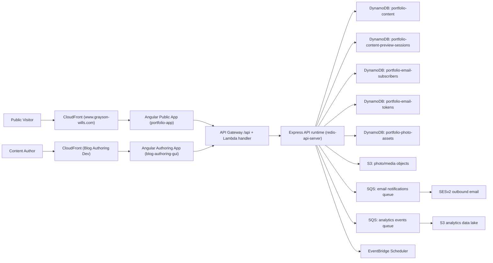
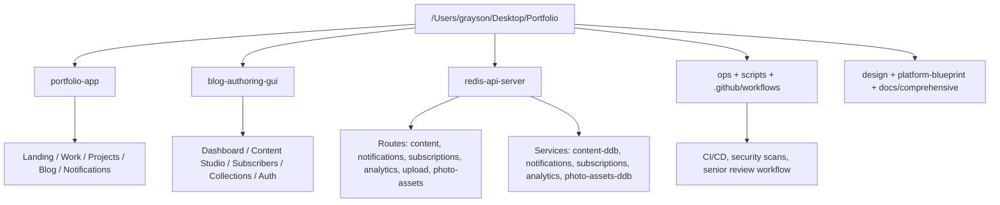
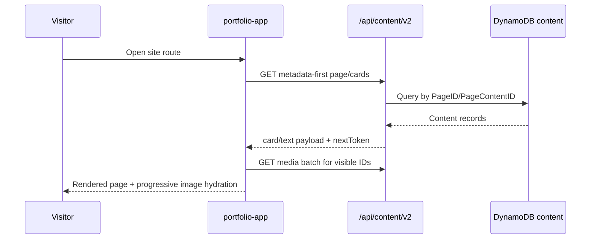
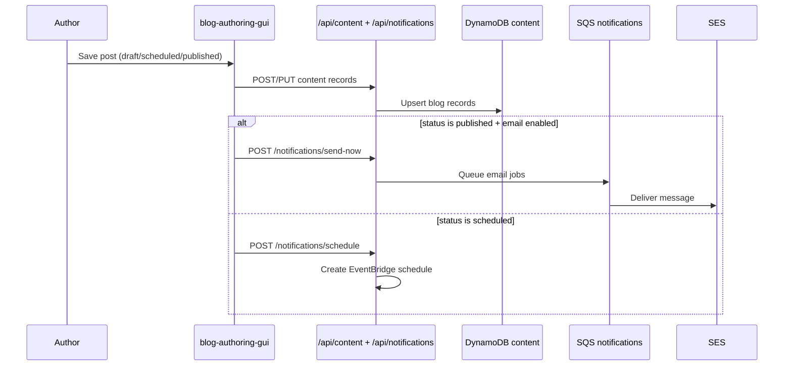

# 01 - Project System Visual Mockup

This document provides a visual map of the full project platform from user-facing clients to backend services and data stores.

## 1. Platform Context

## 2. Codebase Topology

## 3. Runtime Boundaries

### Frontend boundary
- `portfolio-app` consumes public read APIs and renders public pages.
- `blog-authoring-gui` consumes authenticated write APIs and admin actions.

### API boundary
- `redis-api-server` is the single backend entry point in production.
- Authenticated writes are enforced by Cognito JWT middleware on write routes.

### Data boundary
- Content and metadata are persisted in DynamoDB.
- Binary assets are persisted in S3 with signed upload flow.
- Email and analytics throughput is decoupled using SQS.

## 4. Primary User Journeys

## 4.1 Public browse journey

## 4.2 Authoring publish journey

## 5. Visual Mockup Sections Covered

This project-level mockup intentionally separates:
- product surfaces (public site vs authoring site),
- backend entry points and middleware,
- persistence layers,
- asynchronous pipelines.

Use `02-aws-architecture-visual-mockup.md` for cloud topology detail and `03-backend-service-interplay.md` for service-level sequences.
