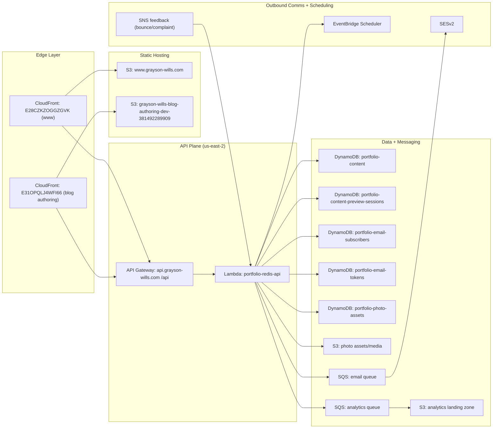
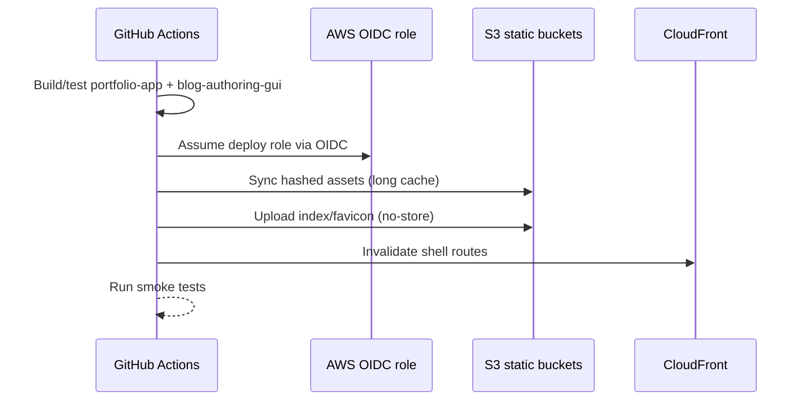
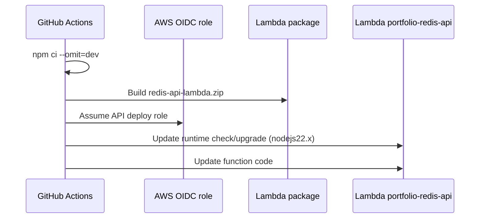

# 02 - AWS Architecture Visual Mockup

This document maps the AWS runtime topology, deployment pathways, and operational boundaries.

## 1. Cloud Topology

## 2. CI/CD to AWS

## 2.1 Frontend deploy flow (`.github/workflows/ci-cd.yml`)

## 2.2 API deploy flow (`.github/workflows/api-deploy.yml`)

## 3. Runtime Security and Reliability Controls

### Edge + static
- CloudFront in front of both public and authoring sites.
- SPA shell invalidations target route entry points.
- HTML and favicon served no-cache; hashed JS/CSS immutable cache.

### API process controls
- `helmet`, CORS allowlist, compression.
- Rate limiting:
  - general `/api/*` limiter
  - stricter write limiter
  - dedicated analytics limiter.
- bounded request body parsing (`2mb` limits).

### Data + queue controls
- DynamoDB for source-of-truth records.
- SQS for asynchronous email and analytics throughput.
- EventBridge Scheduler for scheduled publish notifications.
- SNS ingestion path for SES bounce/complaint updates.

## 4. AWS Resource Inventory (Current Naming in Repo)

| Category | Resource | Source |
|---|---|---|
| Public distribution | `E28CZKZOGGZGVK` | `ci-cd.yml` |
| Authoring distribution | `E31OPQLJ4WFI66` | `ci-cd.yml` |
| Public bucket | `www.grayson-wills.com` | `ci-cd.yml` |
| Authoring bucket | `grayson-wills-blog-authoring-dev-381492289909` | `ci-cd.yml` |
| API Lambda | `portfolio-redis-api` | `api-deploy.yml` |
| API region | `us-east-2` | workflows + code defaults |
| Content table | `portfolio-content` | README + runtime env |
| Preview table | `portfolio-content-preview-sessions` | README + runtime env |
| Subscriber table | `portfolio-email-subscribers` | notifications/subscriptions services |
| Token table | `portfolio-email-tokens` | notifications/subscriptions services |
| Photo assets table | `portfolio-photo-assets` | photo-assets service |

## 5. Suggested Diagram Update Process

1. Update Markdown diagram first when architecture changes.
2. Regenerate matching Word documentation in `/Users/grayson/Desktop/Portfolio/docs/comprehensive/word`.
3. Validate workflow names, bucket names, and distribution IDs against `.github/workflows`.
4. Keep region assumptions explicit (`us-east-2` unless intentionally changed).
