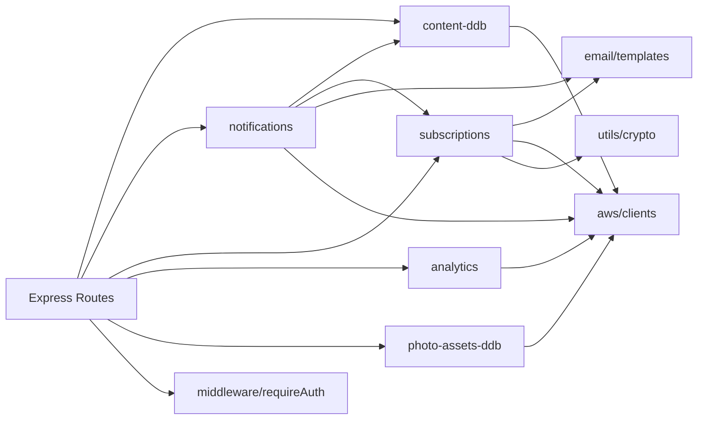
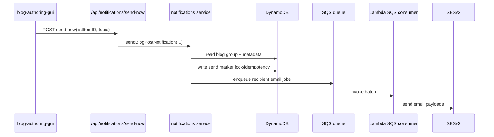
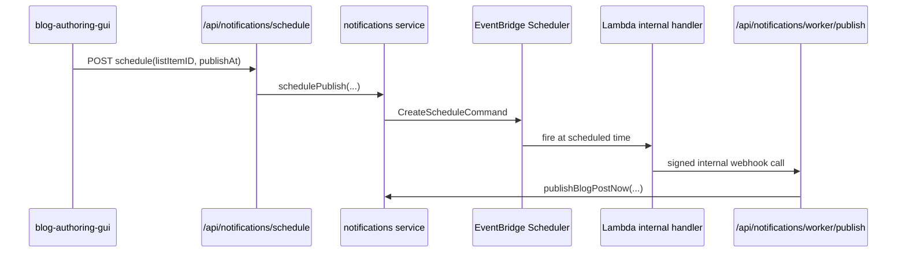
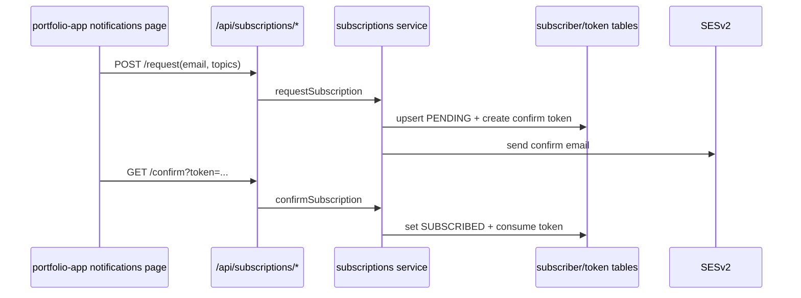
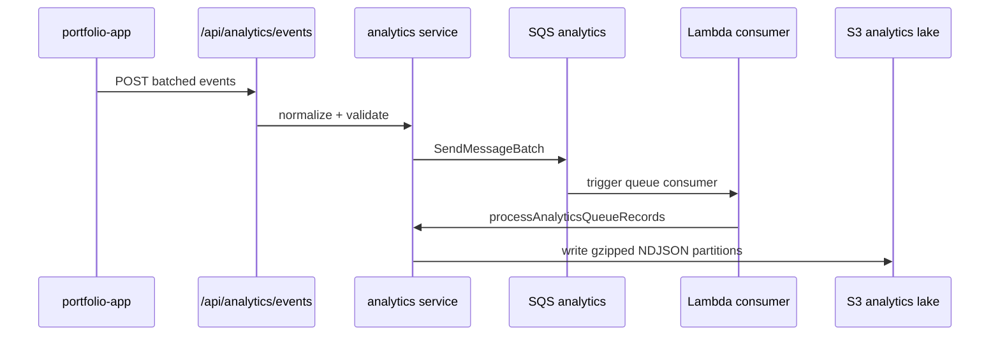

# 03 - Backend Service Interplay

This document describes how backend routes and services interact, including synchronous and asynchronous paths.

## 1. Route to Service Map

| Route Prefix | Route File | Primary Services |
|---|---|---|
| `/api/content` | `src/routes/content.js` | `content-ddb`, `preview-session-ddb`, `content-index`, `media-url` |
| `/api/notifications` | `src/routes/notifications.js` | `notifications`, `subscriptions` |
| `/api/subscriptions` | `src/routes/subscriptions.js` | `subscriptions` |
| `/api/analytics` | `src/routes/analytics.js` | `analytics` |
| `/api/photo-assets` | `src/routes/photo-assets.js` | `photo-assets-ddb`, signed S3 upload flow |
| `/api/upload` | `src/routes/upload.js` | upload path + S3/public URL handling |
| `/api/admin` | `src/routes/admin.js` | Redis Cloud API helper |
| `/api/health` | `src/routes/health.js` | DynamoDB ping + optional Redis compatibility ping |
| `/media/:key` | `src/routes/media.js` | media proxy / rewrite path |

## 2. Service Dependency Graph

## 3. High-Value Sequences

## 3.1 Blog publish now with email

## 3.2 Scheduled publish

## 3.3 Subscriber lifecycle

## 3.4 Analytics pipeline

## 4. Data Contracts

## 4.1 Core content record
- `ID` (PK)
- `PageID`, `PageContentID`
- `ListItemID` for grouping
- `Text`, `Photo`
- `Metadata` object
- `CreatedAt`, `UpdatedAt`

## 4.2 Collections extension (authoring only)
- namespace: `PageID=4`
- category registry: `PageContentID=16`
- entries: `PageContentID=17`
- visibility gating in metadata: `isPublic` + `visibility`.

## 5. Reliability and Guardrails in Code

- request path cache invalidates on write methods.
- write endpoints are protected by Cognito auth middleware.
- queue consumers return partial batch failures for safe redrive behavior.
- notification flow uses send markers and lock windows to reduce duplicate sends.
- health probes expose backend readiness state for DynamoDB and Redis compatibility mode (if enabled).
- `v2` read endpoints enforce bounded limits, token validation, and filter-hash guardrails.
- metadata-first + media-batch split lowers payload size on initial list route reads.

## 6. File-Level Anchors

- API composition: `/Users/grayson/Desktop/Portfolio/redis-api-server/src/app.js`
- Lambda multiplexer: `/Users/grayson/Desktop/Portfolio/redis-api-server/src/lambda.js`
- Content store: `/Users/grayson/Desktop/Portfolio/redis-api-server/src/services/content-ddb.js`
- Notifications engine: `/Users/grayson/Desktop/Portfolio/redis-api-server/src/services/notifications.js`
- Subscription engine: `/Users/grayson/Desktop/Portfolio/redis-api-server/src/services/subscriptions.js`
- Analytics engine: `/Users/grayson/Desktop/Portfolio/redis-api-server/src/services/analytics.js`
- Photo assets metadata: `/Users/grayson/Desktop/Portfolio/redis-api-server/src/services/photo-assets-ddb.js`
