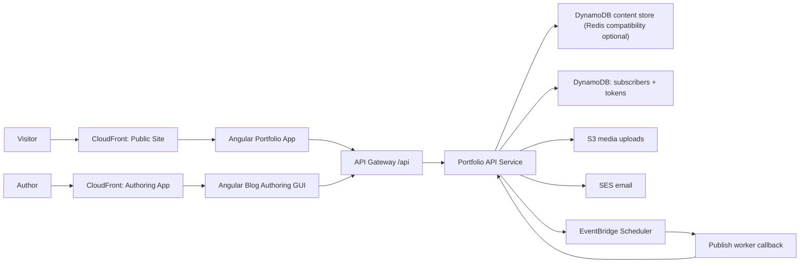

# 01. Solution Architecture

## Objective

Use a split-platform model:
- Public portfolio frontend (read-focused)
- Authenticated authoring frontend (write-focused)
- Shared API service as integration and policy layer
- Managed cloud data/services behind the API

## Runtime Topology

## Editable FigJam Versions

- Platform architecture: [Portfolio Platform Architecture](https://www.figma.com/online-whiteboard/create-diagram/2cf18970-4df0-4474-aed5-a647190da3b3?utm_source=other&utm_content=edit_in_figjam&oai_id=&request_id=8a0d7073-d88b-49ff-96b4-bcc5b82ae294)
- Publish/email flow: [Blog Publish + Email Automation Flow](https://www.figma.com/online-whiteboard/create-diagram/e89331b0-3b0b-4d0c-8e37-1e9577eeecab?utm_source=other&utm_content=edit_in_figjam&oai_id=&request_id=18481ad8-414e-445e-aaf3-ed3d46532221)

## Layer Responsibilities

- Public site:
  - Render pages, blog, SEO assets, notification confirmation routes.
  - Never hold privileged credentials.
- Authoring app:
  - Content Studio + editor + scheduling controls.
  - Uses Cognito auth and bearer token for writes.
- API layer:
  - CORS, rate limiting, auth checks, routing, validation.
  - Encapsulates data/model changes and external integrations.
- Data/services layer:
  - DynamoDB (content)
  - DynamoDB (subscriber state, token state)
  - S3 (media)
  - SES/EventBridge (notifications + scheduling)

## Why This Structure Works

- Decouples publishing UX from public rendering UX.
- Keeps write security centralized in middleware.
- Allows backend data-store evolution without frontend rewrites.
- Supports scheduled publishing and event-driven notifications.
